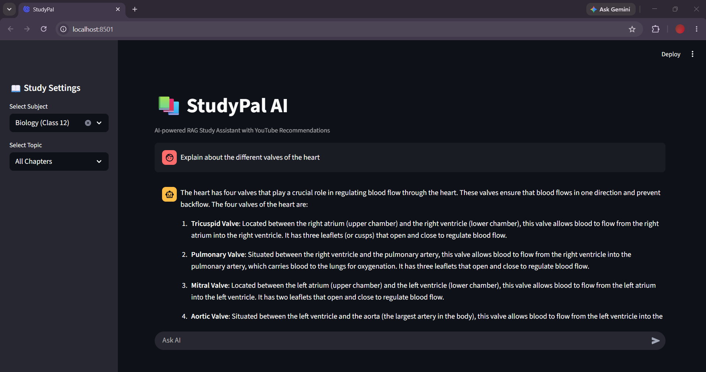
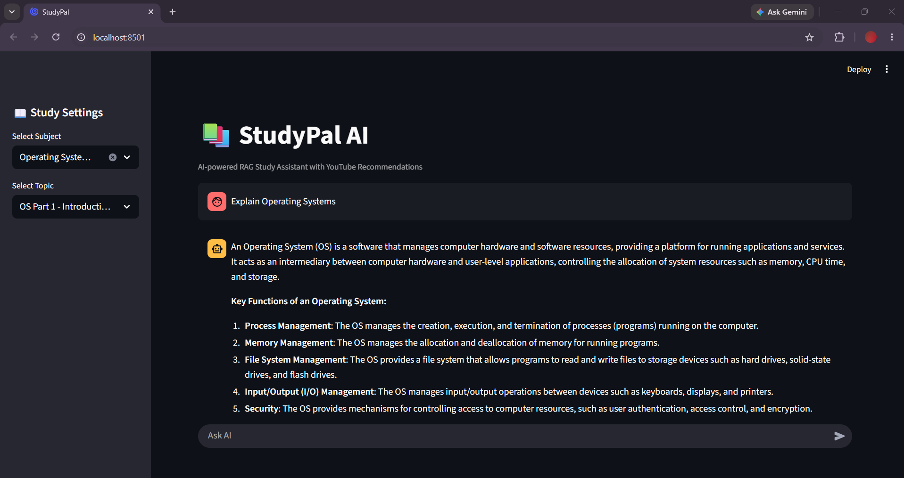
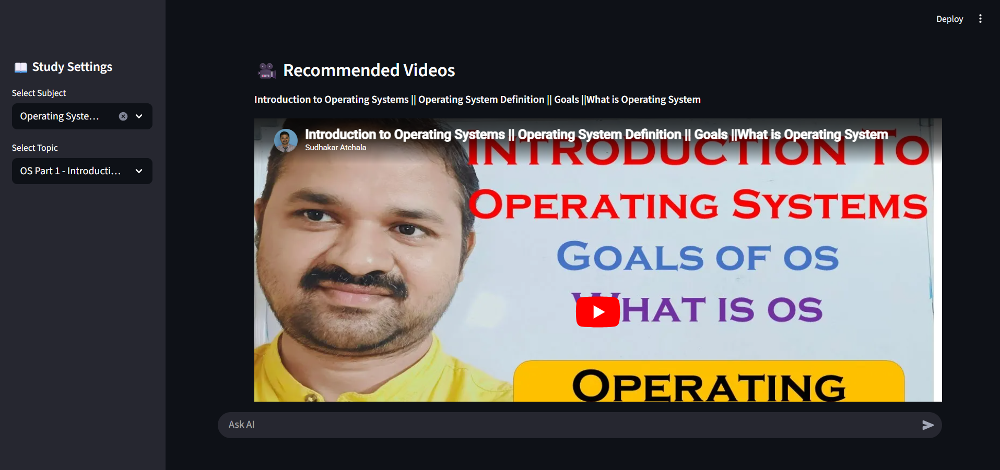

# StudyPal – AI-Powered Study Assistant

> Ask questions from your textbook. Get answers. Watch the right videos. Actually understand it.

StudyPal is a Retrieval-Augmented Generation (RAG) app that lets students chat with their textbooks. Upload a PDF, ask a question, and get a grounded answer — pulled from the actual book content, not hallucinated — along with curated YouTube video recommendations for deeper learning.

---

## Features

- **Chat with your textbook** — answers are grounded in your actual book content via RAG
- **Subject & chapter-wise knowledge base** — organized retrieval, not a single giant blob
- **YouTube video recommendations** — relevant videos suggested alongside every answer
- **Conversational memory** — ask follow-ups naturally, context is preserved across turns
- **Fast responses** — powered by Groq's Llama 3.3 70B, one of the fastest LLM inference APIs available
- **Semantic search** — ChromaDB + HuggingFace `all-MiniLM-L6-v2` embeddings for accurate retrieval

---

## Supported Subjects

| Level | Subject |
|-------|---------|
| Class 12 | Biology |
| B.Tech | Operating Systems |

> More subjects coming — see [Future Improvements](#future-improvements).

---

## Tech Stack

| Layer | Technology |
|-------|-----------|
| Frontend | Streamlit |
| LLM | Groq API — Llama 3.3 70B Versatile |
| Orchestration | LangChain |
| Embeddings | HuggingFace `all-MiniLM-L6-v2` |
| Vector Database | ChromaDB |
| Document Processing | Unstructured, Recursive Character Text Splitter |
| Video Recommendations | youtube-search-python |

---

## Project Structure

```
StudyPal/
│
├── data/
│   ├── class_12/           # Class 12 textbook PDFs
│   └── operating_systems/  # OS textbook PDFs
│
├── src/
│   ├── main.py             # Streamlit app entry point
│   ├── chatbot_utility.py  # RAG chain, memory, prompt logic
│   ├── get_yt_video.py     # YouTube video recommendation
│   ├── vectorize_book.py   # Generic vectorization utility
│   ├── vectorize_script.py # Biology vectorization
│   └── vectorize_os.py     # Operating Systems vectorization
│
├── vector_db/              # ChromaDB store (full book)
├── chapters_vector_db/     # ChromaDB store (chapter-wise)
│
├── requirements.txt
├── .env
└── README.md
```

---

## Getting Started

### 1. Clone the repository

```bash
git clone https://github.com/YOUR_USERNAME/StudyPal---Study-assistant.git
cd StudyPal---Study-assistant
```

### 2. Create and activate a virtual environment

```bash
python -m venv .venv
```

```bash
# Windows
.venv\Scripts\activate

# Linux / macOS
source .venv/bin/activate
```

### 3. Install dependencies

```bash
pip install -r requirements.txt
```

### 4. Set up environment variables

Create a `.env` file in the project root:

```env
GROQ_API_KEY=your_groq_api_key_here
DEVICE=cpu
```

Get your free Groq API key at [console.groq.com](https://console.groq.com).

---

## Building the Vector Database

Before running the app, you need to vectorize your textbooks. Run the script for each subject you want to use.

**Biology (Class 12)**
```bash
python src/vectorize_script.py
```

**Operating Systems (B.Tech)**
```bash
python src/vectorize_os.py
```

This will chunk the PDFs, generate embeddings, and persist them to `vector_db/` and `chapters_vector_db/`.

---

## Running the App

```bash
streamlit run src/main.py
```

Open `http://localhost:8501` in your browser.

---

## How It Works

```
PDF Textbooks
     │
     ▼
Document Chunking (Recursive Character Text Splitter)
     │
     ▼
Embeddings (HuggingFace all-MiniLM-L6-v2)
     │
     ▼
ChromaDB (Vector Store)
     │
     ├─── User asks a question
     │         │
     │         ▼
     │    Semantic Search → Relevant Chunks Retrieved
     │         │
     │         ▼
     │    Groq Llama 3.3 70B generates answer
     │         │
     │         ▼
     └─── Answer + YouTube Video Recommendations
```

---

## Future Improvements

- [ ] More Class 12 subjects (Physics, Chemistry, Maths)
- [ ] B.Tech subjects (DBMS, Computer Networks, COA, DSA)
- [ ] User PDF uploads — bring your own textbook
- [ ] Quiz generation from chapter content
- [ ] Flashcard generation
- [ ] Notes / summary export
- [ ] Voice input
- [ ] Multi-language support

---
<h2 align="center">📸 Application Screenshots</h2>

<table>
<tr>
<td align="center">
<b>🧬 Biology Assistant</b><br><br>

</td>
</tr>

<tr>
<td align="center">
<b>💻 Operating Systems Assistant</b><br><br>

</td>

<td align="center">
<b>🎥 YouTube Recommendations</b><br><br>

</td>
</tr>
</table>


## Author

**Madhav Karthik Nambi**  
GitHub: madhavkn11

---

*If this project helped you, consider giving it a ⭐ on GitHub — it helps others find it too.*
